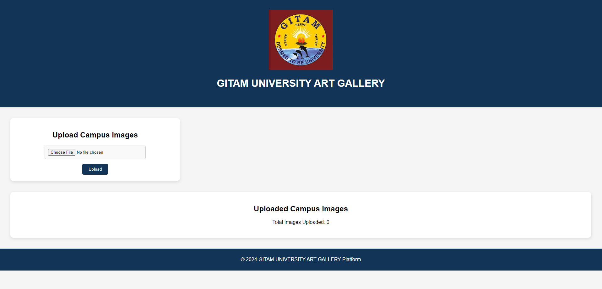
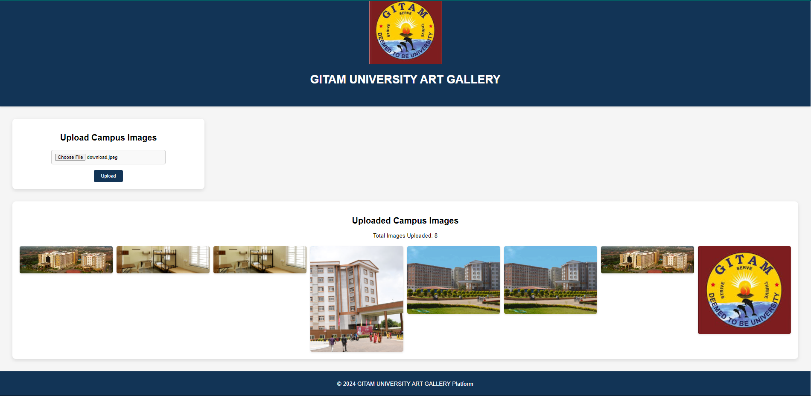

# GITAM University Art Gallery

Welcome to the GITAM University Art Gallery project! This web application allows users to upload and view campus images in an interactive gallery format.

## Table of Contents

- [Features](#features)
- [Technologies Used](#technologies-used)
- [Installation](#installation)
- [Usage](#usage)
- [Contributing](#contributing)
- [License](#license)

## Features

- **Image Upload**: Users can upload images of campus activities and events.
- **Image Gallery**: Display of uploaded images in a visually appealing grid format.
- **Dynamic Image Count**: The total number of uploaded images is dynamically updated and displayed.
- **Responsive Design**: The layout adjusts to different screen sizes for optimal viewing on both desktops and mobile devices.

## Technologies Used

- **HTML**: Structure of the web application.
- **CSS**: Styling for a clean and modern design.
- **JavaScript**: Interactivity and image handling logic.
- **[Optional] Server-side technology**: Can be integrated for actual file uploads (not implemented in this demo).

## Installation

1. **Clone the repository**:
   ```bash
   git clone <repository-url>
   
   
 ## Screenshots

Here are some screenshots of the application in use:

1. **Homepage**:
   

2. **Website when Uploaded Images**:
   
   

3. **Stored Images**:
   

